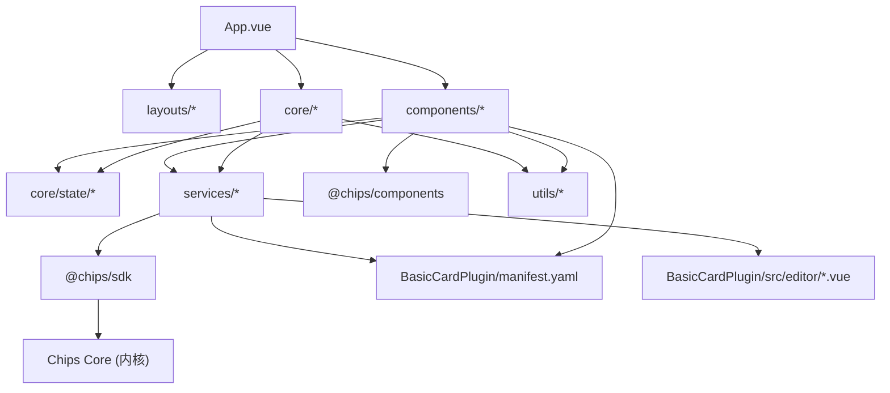

# 编辑引擎模块梳理

## 模块与路径
- `Chips-Editor/src/App.vue`: 应用入口，初始化布局、工具窗口、主题与多语言。
- `Chips-Editor/src/core/`: 编辑器核心能力。
  - `editor.ts`: 编辑器主控制器。
  - `window-manager.ts`: 窗口管理（创建、聚焦、层级、大小）。
  - `command-manager.ts` + `commands/`: 命令与撤销重做。
  - `card-service.ts`: 卡片读写与状态同步。
  - `card-initializer.ts`: 新建卡片结构生成（符合卡片文件规范）。
  - `drag-drop-manager.ts`: 拖放管理。
  - `file-service.ts`: 文件操作封装（通过 SDK/内核）。
  - `workspace-service.ts`: 工作区管理。
  - `state/`: Pinia 状态（`card.ts`/`ui.ts`/`editor.ts`）。
- `Chips-Editor/src/layouts/`: 布局系统。
  - `infinite-canvas/`: 无限画布布局。
  - `workbench/`: 工作台布局。
  - `LayoutSwitcher.vue`: 布局切换。
- `Chips-Editor/src/components/`: 功能组件。
  - `file-manager/`: 文件管理器。
  - `edit-panel/`: 编辑面板与插件宿主。
  - `card-box-library/`: 卡箱库（卡片/箱子插件列表）。
  - `card-settings/`: 卡片设置与导出。
  - `cover-maker/`: 封面制作器。
  - `drag-drop/`: 拖放可视化与反馈。
  - `window/`: 卡片/工具窗口容器。
  - `dock/`: 程序坞。
  - `history-panel/`: 操作历史。
- `Chips-Editor/src/services/`: 统一接入层。
  - `sdk-service.ts`: SDK 初始化与缓存。
  - `local-core-connector.ts`: 本地内核连接器（开发）。
  - `resource-service.ts`: 资源/转换接口封装。
  - `plugin-service.ts`: 插件注册与编辑组件加载。
  - `i18n-service.ts`: 多语言服务。
- `Chips-Editor/src/plugins/`: 编辑器插件接口与类型。
- `Chips-Editor/src/i18n/`: 编辑器多语言词汇表。
- `Chips-Editor/src/styles/`: 主题变量与全局样式（基于 CSS 变量）。
- `Chips-Editor/src/utils/`: 通用工具（含 ID 生成器）。
- `Chips-Editor/tests/`: 单元/集成/E2E 测试。
- `Chips-Editor/docs`、`Chips-Editor/技术文档`、`Chips-Editor/需求文档`、`Chips-Editor/开发规范.md`: 规范与设计文档。

## 关键依赖
- `@chips/sdk`: 所有核心能力通过 SDK 访问微内核。
- `@chips/components`: UI 组件库（样式由主题包提供）。
- `@chips/core`、`@chips/foundation`: 内核与公共基础层（通过 SDK 路由访问）。
- `BasicCardPlugin/**`: 基础卡片插件清单与编辑器组件。

## 依赖关系（模块级）

## 规范符合性检查（关键项）
- 组件库：界面组件统一使用 `@chips/components`，卡箱库搜索清空按钮已切换为组件库按钮；封面文件选择仍使用原生 `input[type=file]` 作为隐藏输入（等待组件库提供上传组件时替换）。
- 多语言：界面文案通过 `t()` 获取；卡箱库分类名称已转为多语言 Key；插件/主题名称来自外部清单时按数据原样显示。
- 主题：主题列表来自 `sdk.themes.listThemes()`；默认主题使用 `default-light`；卡片元数据字段使用 `theme` 与规范一致。
- 插件路由：插件通过清单动态注册到 SDK，编辑组件通过清单同目录动态加载；完整的内核插件路由（远端/安装包）待接入。
- ID 规范：`generateId62` 生成 10 位 62 进制 ID，避免全 0，校验函数同步更新。
