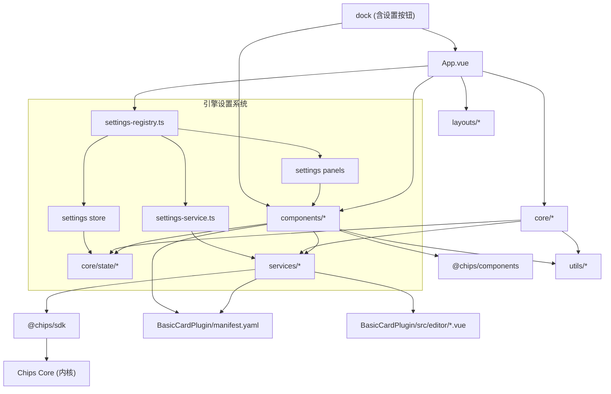

# 编辑引擎模块梳理

## 模块与路径
- `Chips-Editor/src/App.vue`: 应用入口，初始化布局、工具窗口、设置系统注册中心、主题与多语言。
- `Chips-Editor/src/core/`: 编辑器核心能力。
  - `editor.ts`: 编辑器主控制器。
  - `window-manager.ts`: 窗口管理（创建、聚焦、层级、大小）。
  - `command-manager.ts` + `commands/`: 命令与撤销重做。
  - `card-service.ts`: 卡片读写与状态同步。
  - `card-initializer.ts`: 新建卡片结构生成（符合卡片文件规范）。
  - `drag-drop-manager.ts`: 拖放管理。
  - `file-service.ts`: 文件操作封装（通过 SDK/内核）。
  - `workspace-service.ts`: 工作区管理。
  - `state/`: Pinia 状态管理。
    - `card.ts`: 卡片数据状态（打开的卡片、活跃卡片、结构等）。
    - `ui.ts`: UI 状态（窗口列表、Dock、画布视口等）。
    - `editor.ts`: 编辑器全局状态（生命周期、布局、连接状态、语言等）。
    - `settings.ts`: 引擎设置状态（通用 Map 容器，面板注册表，设置数据存取）。
- `Chips-Editor/src/layouts/`: 布局系统。
  - `infinite-canvas/`: 无限画布布局（含 WindowLayer 转发设置弹窗事件）。
  - `workbench/`: 工作台布局。
  - `LayoutSwitcher.vue`: 布局切换。
- `Chips-Editor/src/components/`: 功能组件。
  - `file-manager/`: 文件管理器。
  - `edit-panel/`: 编辑面板与插件宿主。
  - `card-box-library/`: 卡箱库（卡片/箱子插件列表）。
  - `card-settings/`: 卡片设置与导出。
  - `cover-maker/`: 封面制作器。
  - `drag-drop/`: 拖放可视化与反馈。
  - `window/`: 卡片/工具窗口容器。
  - `dock/`: 程序坞（含工具窗口图标 + 引擎设置齿轮入口按钮）。
  - `history-panel/`: 操作历史。
  - `engine-settings/`: 引擎设置系统（注册中心架构）。
    - `EngineSettingsDialog.vue`: 全屏模态设置弹窗（左侧菜单栏 + 右侧动态面板）。
    - `settings-registry.ts`: 设置注册中心（声明式注册所有内置面板定义）。
    - `styles/settings-panel.css`: 面板共享样式。
    - `panels/`: 6 个设置面板组件。
      - `LanguageSettingsPanel.vue`: 语言与文字（语言、字号、内容比例）。
      - `ThemeSettingsPanel.vue`: 主题设置（主题包选择，日间/夜间是独立主题包，跟随系统自动切换亮暗主题包，安装入口）。
      - `LayoutSettingsPanel.vue`: 引擎模式（无限画布，预留工作台等）。
      - `ToolsSettingsPanel.vue`: 工具管理（已安装工具列表、启用/禁用）。
      - `FileModeSettingsPanel.vue`: 文件管理方式（链接/复制模式）。
      - `AboutPanel.vue`: 关于（版本、协议、技术栈信息）。
- `Chips-Editor/src/services/`: 统一接入层。
  - `sdk-service.ts`: SDK 初始化与缓存。
  - `local-core-connector.ts`: 本地内核连接器（开发）。
  - `resource-service.ts`: 资源/转换接口封装。
  - `plugin-service.ts`: 插件注册与编辑组件加载。
  - `i18n-service.ts`: 多语言服务。
  - `settings-service.ts`: 引擎设置服务（各分类的 onChange 处理器、主题/语言/布局切换的 SDK 协调）。
- `Chips-Editor/src/plugins/`: 编辑器插件接口与类型。
- `Chips-Editor/src/i18n/`: 编辑器多语言词汇表。
- `Chips-Editor/src/types/`: 类型定义。
  - `settings.ts`: 设置系统类型（SettingsPanelDefinition、各分类数据接口、SettingsChangeEvent 等）。
- `Chips-Editor/src/styles/`: 主题变量与全局样式（基于 CSS 变量）。
- `Chips-Editor/src/utils/`: 通用工具（含 ID 生成器）。
- `Chips-Editor/tests/`: 单元/集成/E2E 测试。
- `Chips-Editor/docs`、`Chips-Editor/技术文档`、`Chips-Editor/需求文档`、`Chips-Editor/开发规范.md`: 规范与设计文档。

## 关键依赖
- `@chips/sdk`: 所有核心能力通过 SDK 访问微内核（含 ThemeManager、I18nManager、PluginManager）。
- `@chips/components`: UI 组件库（样式由主题包提供）。
- `@chips/core`、`@chips/foundation`: 内核与公共基础层（通过 SDK 路由访问）。
- `BasicCardPlugin/**`: 基础卡片插件清单与编辑器组件。

## 依赖关系（模块级）

## 引擎设置系统架构

设置系统采用「注册中心」架构，每个设置分类是一个完全自治的模块：

- **SettingsPanelDefinition**: 面板定义（分类元数据 + Vue 组件 + 默认数据 + onChange 处理器）
- **settings-registry.ts**: 声明式注册所有内置面板定义，集中管理
- **Settings Store**: 通用 Map 容器（`Record<categoryId, data>`），不知道具体分类
- **Settings Service**: 各分类的 onChange 处理器（协调 SDK ThemeManager / I18nManager / EditorStore）
- **EngineSettingsDialog**: 全屏模态弹窗，左侧菜单 + 右侧 `<component :is>` 动态渲染
- **Dock 入口**: 程序坞末尾的齿轮按钮，点击打开设置弹窗

扩展新分类只需 2 步：创建面板组件 + 在注册中心追加定义。

## 规范符合性检查（关键项）
- 组件库：界面组件统一使用 `@chips/components`，卡箱库搜索清空按钮已切换为组件库按钮；封面文件选择仍使用原生 `input[type=file]` 作为隐藏输入（等待组件库提供上传组件时替换）。
- 多语言：界面文案通过 `t()` 获取；卡箱库分类名称已转为多语言 Key；引擎设置的 6 个分类全部使用多语言 Key（含 zh-CN 和 en-US）；插件/主题名称来自外部清单时按数据原样显示。
- 主题：主题列表来自 `sdk.themes.listThemes()`；默认主题使用 `default-light`；卡片元数据字段使用 `theme` 与规范一致；引擎设置中主题切换通过 Settings Service 协调 SDK ThemeManager 和 UIStore。
- 插件路由：插件通过清单动态注册到 SDK，编辑组件通过清单同目录动态加载；完整的内核插件路由（远端/安装包）待接入。
- ID 规范：`generateId62` 生成 10 位 62 进制 ID，避免全 0，校验函数同步更新。
- 设置持久化：Settings Store 提供 `exportAll()` / `importAll()` 接口，对接配置系统（`config.get` / `config.set`）待接入。